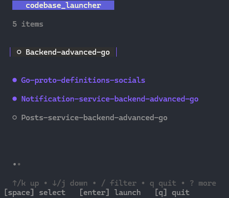

# Codebase Launcher

A simple TUI (Text User Interface) application built with Go that allows users to navigate through directories and open them in Visual Studio Code. This tool provides a clean and minimal interface for quickly launching codebases.



## Features

- Browse directories in the current path.
- Select multiple folders to open in Visual Studio Code.
- Simple and intuitive keyboard controls.

## Next features / ideas
- [ ] it should be lunched from everwhere, users can only install it and than can lunch it on whatever directory they were in to list the directory on that current path that they want to open. 
- [ ] Consider adding a feature that allows users to launch the TUI, which will then display the current directories at the current level. Users can access each folder at this level and navigate into its subfolders ...

## Installation

1. Clone the repository:
   ```bash
   git clone <repository-url>
   cd <project-directory>
   ```

2. Install the required dependencies:
   ```bash
   go get
   ```

## Usage

Run the application:
```bash
go run main.go
```

- Use the arrow keys to navigate through the list of directories.
- Press the `space` key to select/deselect directories.
- Press `enter` to open the selected directories in Visual Studio Code.
- Press `q` to quit the application.


## *Feel free to modify any sections as needed!# codebase_luncher*s ✨
